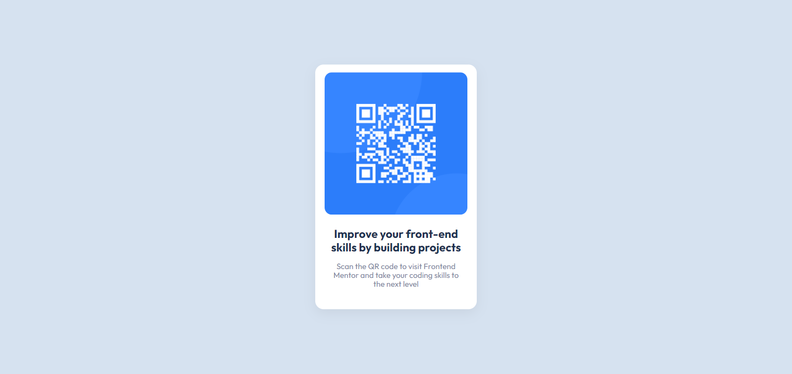

# Frontend Mentor - QR code component solution

This is a solution to the [QR code component challenge on Frontend Mentor](https://www.frontendmentor.io/challenges/qr-code-component-iux_sIO_H). Frontend Mentor challenges help you improve your coding skills by building realistic projects.

## Table of contents

- [Overview](#overview)
  - [Screenshot](#screenshot)
  - [Links](#links)
- [My process](#my-process)
  - [Built with](#built-with)
  - [What I learned](#what-i-learned)
  - [Useful resources](#useful-resources)
- [Author](#author)

**Note: Delete this note and update the table of contents based on what sections you keep.**

## Overview

### Screenshot

### Links

- Solution URL: [https://github.com/Yugi-o/QR-code-component](https://github.com/Yugi-o/QR-code-component)
- Live Site URL: [https://yugi-o.github.io/QR-code-component](https://yugi-o.github.io/QR-code-component)

## My process

### Built with

- Semantic HTML5 markup
- CSS custom properties
- Mobile-first workflow

### What I learned

I used this project to start trimming css to get back to fronted development, it helped me remember some basic things like variables, font family and centering.

### Useful resources

- [Beautiful CSS box-shadow examples](https://getcssscan.com/css-box-shadow-examples) - This helped me with the container shadow and I will use it in the future as it gives you many nice types of shadows.

## Author

- Frontend Mentor - [@Yugi-o](https://www.frontendmentor.io/profile/Yugi-o)
